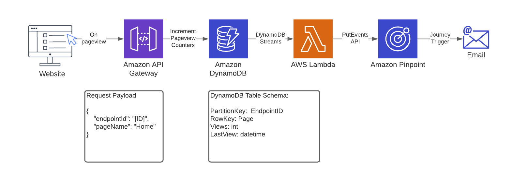
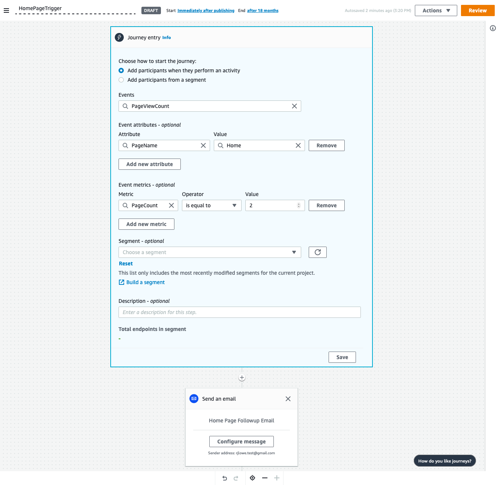

# Amazon Pinpoint PageView Campaign Trigger

This repository shows how to set up a simple architecture to track page views of unique website pages.  The unique count of each pageview by user can then be fed into Pinpoint to trigger messaging.  Example use-case:  You have an e-commerce store who wants to target users who have visited the product details page of a certain product multiple times with a message to purchase.

## Architecture




## DeploymentId

1. Create an Amazon Pinpoint project and note the Project Id from the Settings -> General Settings menu item.  See [docs](https://docs.aws.amazon.com/pinpoint/latest/userguide/gettingstarted-create-project.html)

1. Deploy the [template.yaml](template.yaml) file in Amazon CloudFormation to deploy the architecture.  Note the Output variable `RestEndpoint`

1. Update website to make a POST call the RestEndpoint with the payload:
```
{
    "endpointId": "[ENDPOINT ID HERE]",
    "pageName": "Home"
}
```
Or test via curl:  
```
$  curl -X POST -H "Content-Type: application/json" -d '{"endpointId": "[ID]","pageName": "Home"}' <RestEndpoint>
```

## Journey Set up


